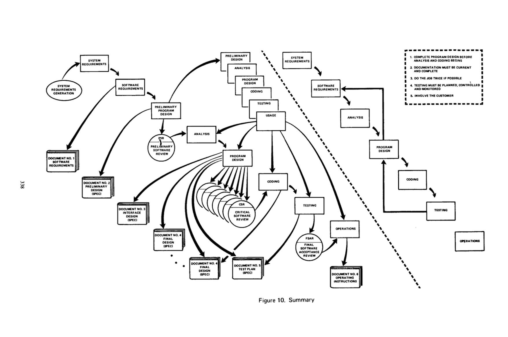
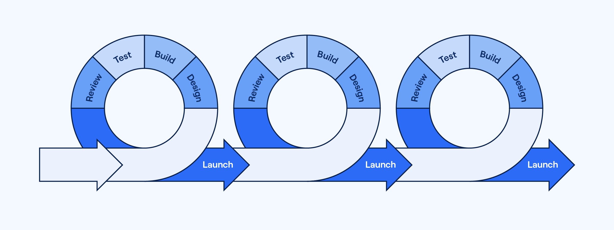

# Organisation du travail informatique

## Modèle en cascade

En 1970, Winston W. Royce, alors directeur du Lockheed Software
Technology Center, publie un article intitulé « *Managing the
development of large software systems* » dans lequel il décrit sont
expérience du développement de système logiciel à grande échelle.

Selon Royce, peu importe la taille ou la complexité d'un projet, tout
développement de système logiciel passe nécessairement à travers
deux étapes : l'analyse et la programmation. D'ailleurs, ce sont
souvent les deux seules étapes nécessaires à la production d'un
logiciel, à condition que celui-ci soit de petite envergure, ou qu'il
soit seulement utilisé à l'interne.

Le développement de système logiciel de grande envergure dont la
planification inclue *seulement* ces deux étapes, continue Royce,
est toutefois voué à l'échec. À l'analyse et à la programmation
doivent s'ajouter plusieurs étapes supplémentaires, dont un examen
des exigences du système, une étude des exigences du logiciel, le
design du logiciel, une phase de test, et l'intégration du logiciel
dans son environnement d'opération.

Ces étapes sont *séquentielles* : les besoins sont d'abord évalués,
le logiciel est ensuite conçu, puis programmé, puis testé, et enfin
livré. De cette façon, la portée du travail à accomplir est
circonscrit à l'intérieur de limites gérables. Il peut y avoir
une itération avec l'étape qui précède ou celle qui suit
immédiatement l'étape courante, mais il est difficile de se tourner
vers les étapes plus éloignées en cas de difficulté.

Ceux et celles ayant déjà travaillé à la conception de logiciel
ont sûrement déjà identifié les risques d'une telle approche
« en cascade » : si le logiciel échoue à répondre aux contraintes
et aux besoins du devis lors de la phase de test, tout est à
recommencer. Il est difficile, voir impossible, d'effectuer des
corrections au design du logiciel au moment où ce dernier est
assez avancé dans son processus de conception pour évaluer son
efficacité.

Loins d'être dupe, Royce est conscient des risques de la méthode en
cascade. Dans son article, il constate qu'il est souvent nécessaire de
renvoyer aux étapes précédentes en cas d'erreur. Il suggère lui-même
des améliorations afin que la conception du système logiciel puisse
évoluer tout au long de son élaboration. Son modèle révisé reste
toutefois proche de l'original.

## Développement itératif

Il existe des alternatives au modèle en cascade depuis longtemps, mais
l'origine de la plus populaire remonte au début des années 2000, lorsque
dix-septs figures du développement logiciel se réunissent pour tenter
d'unifier leurs méthodes respectives. De cette réunion émerge le
[Manifeste pour le développement Agile de logiciels][Manifeste agile].

[Manifeste agile]: https://agilemanifesto.org/iso/fr/manifesto.html

La méthode agile est une approche itérative qui consiste à découper le
projet en plusieurs itérations appelées « sprint », au cours desquelles
une version partielle du logiciel attendu est développée puis soumise au
client pour validation. Chaque sprint est un mini-projet qui comporte
les même activités de développement listées précédemment : analyse,
conception, codage, test, etc. L'objectif est d'obtenir au terme de
chaque itération un sous-ensemble opérationnel du système cible, et, à
la fin du dernier sprint, la version finale du produit.