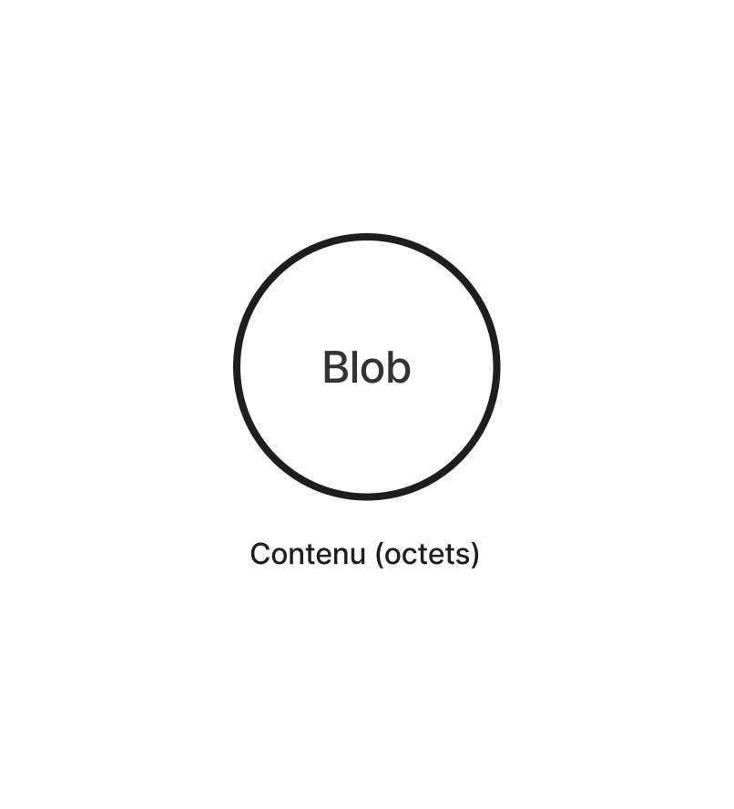
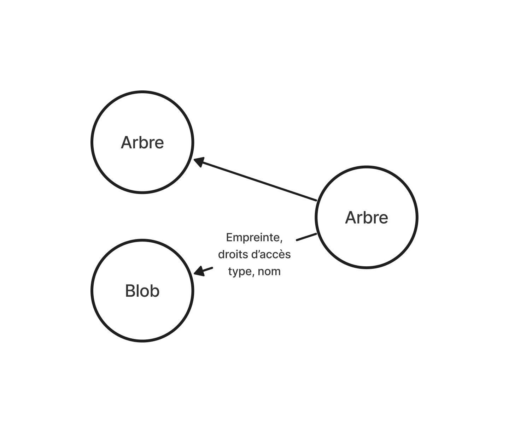
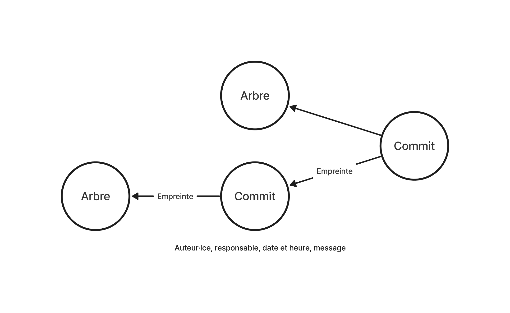
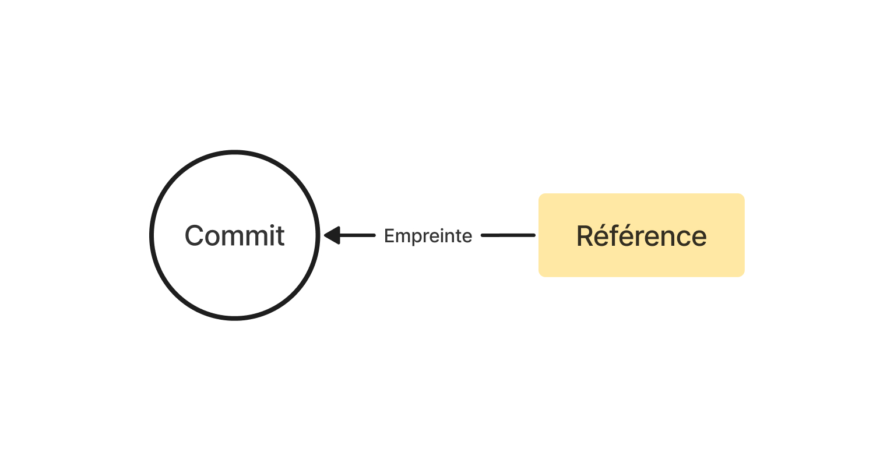
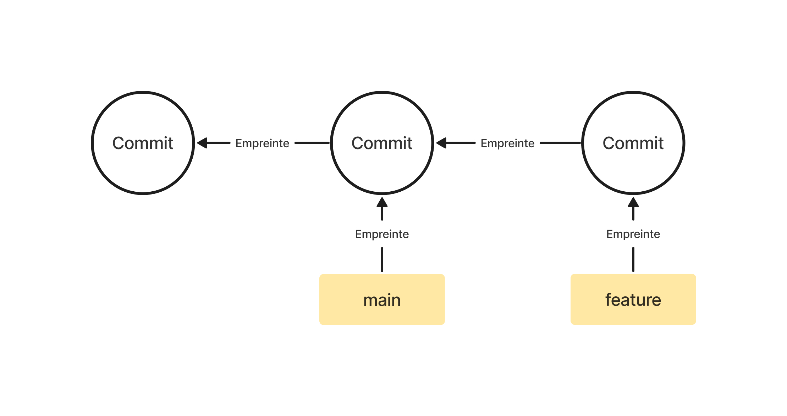
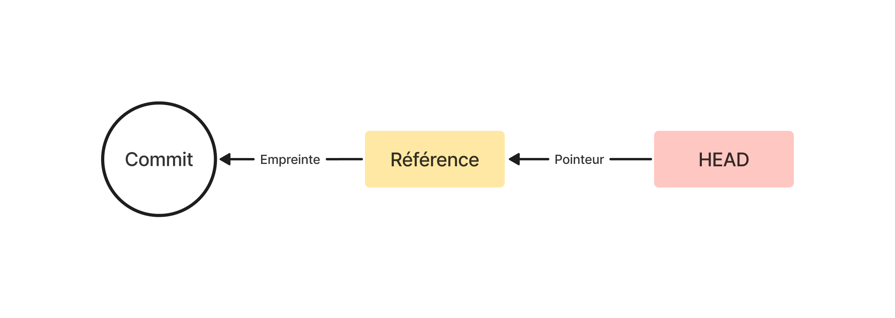

# Git : Fonctionnement interne


On apprend souvent Git de haut en bas, c'est-à-dire en commençant par
son interface en ligne de commande, et en terminant par son
fonctionnement interne, ce dernier étant même souvent omis. On mémorise
quelques commandes, on les évoque comme des incantations magiques, et on
souhaite qu'aucune erreur se produise. Si, par quelconque malheur, les
choses tournent au vinaigre, on s'en tire souvent en suivant l'approche
décrite dans la bande-dessinée ci-haut : on efface tout et on
recommence.

Vu la [complexité][git-man-page] de Git, cette approche est
compréhensible. Mais alors qu'une interface difficile doit être
*mémorisée*, le fonctionnement d'un programme peut être *compris*. Pour
cette raison, nous proposons ici une explication de bas en haut, en
commençant par le modèle de données de Git. Une fois celui-ci compris,
les commandes peuvent être mieux appréhendées en termes de leur
manipulation des données sous-jacentes.

[git-man-page]: https://git-man-page-generator.lokaltog.net

## Dépôt

Au cœur de Git est le **dépôt** (*repository*, en anglais) : un
répertoire caché nommé `.git` qui se trouve à la racine de l'**arbre de
travail** (*working tree*, en anglais).

Quoiqu'on appelle souvent l'entièreté d'un projet suivi par Git « dépôt
», ce terme désigne uniquement le répertoire `.git`. Le répertoire dans
lequel se trouve le dépôt ainsi que les sous-répertoires et les fichiers
qu'il contient se nomme « arbre de travail ».

```
Arbre de travail
├── .git/ (dépôt)
└── ...
```

Un dépôt est un *système de fichiers adressable par contenu*,
c'est-à-dire une base de paires clé/valeur qui permet de stocker et de
récupérer des données en fonction de leur contenu.

Initialisons un dépôt en exécutant la commande `git init` dans un
répertoire quelconque, et regardons ce qu'il contient :

```
$ mkdir git-demo && cd git-demo
$ git init
Initialized empty Git repository in git-demo/.git/
$ ls -F1 .git
HEAD
config
description
hooks/
info/
objects/
refs/
```

## Objets

De tous les sous-répertoire du dépôt, le plus important est `objects`.
C'est dans celui-ci que Git stocke les données sous forme de fichier.
Git enregistre un seul **object** par fichier.

Il existe plusieurs types d'objets, chacun correspondant à un type de
donnée différent :

- Blob
- Arbre
- Commit
- Tag

Un object est *immuable*, c'est-à-dire qu'il ne peut pas être modifié.
Un nouvel object est créé pour chaque changement.

### Blob



Un objet **blob** est une série d'octets qui représente le contenu (et
seulement le contenu) d'un fichier. C'est le type de donné élémentaire
de Git.

Ajoutons un fichier dans notre arbre de travail, et enregistrons-le
ensuite dans la base d'objets Git afin de voir à quoi ressemble un objet
blob :

```
$ echo "Hello, World" > hello.txt
$ git hash-object -w hello.txt
3fa0d4b98289a95a7cd3a45c9545e622718f8d2b
```

La sous-commande `hash-object`, suivie de l'option `-w` (pour
« *write* »), crée un blob à partir du fichier `hello.txt`, enregistre
le blob dans le répertoire `objects`, puis imprime l'empreinte SHA-1 qui
permet d'identifier l'objet. Puisqu'un objet blob ne contient pas le nom
du fichier, son empreinte est la seule façon de le retrouver.

L'**empreinte** d'un objet est la [somme de contrôle][] de son contenu.
Étant donné deux fichiers identiques, l'empreinte sera toujours la même.

[somme de contrôle]: https://fr.wikipedia.org/wiki/Somme_de_contrôle

Pour s'assurer que Git a bien stocké nos données, imprimons les fichiers
qui se trouvent dans le répertoire `objects` :

```
$ find .git/objects -type f
.git/objects/3f/a0d4b98289a95a7cd3a45c9545e622718f8d2b
```

Il y a maintenant un fichier dans le répertoire `objects` qui correspond
au contenu de `hello.txt`. Le sous-répertoire `3f` est nommé d'après les
2 premiers caractères de l'empreinte, et le fichier qui contient l'objet
blob est nommé d'après les 38 caractères restants.

Pour vérifier que l'objet correspond bien à `hello.txt`, on peut
récupérer son contenu avec la sous-commande `cat-file`, suivie de
l'option `-p` (pour *pretty-print*) et de son empreinte :

```
$ git cat-file -p 3fa0d
Hello, World
```

Ce qui est bel et bien le contenu du fichier `hello.txt` que nous avons
créé précédemment !

Vous remarquerez qu'il n'est pas nécessaire d'écrire les 40 caractères
de l'empreinte. Les cinq premiers suffisent normalement à identifier
l'objet.

### Arbre



Si un objet blob contient uniquement le contenu d'un fichier, comment
Git enregistre-t-il son nom ? La réponse à cette question nécessite
d'introduire un deuxième type d'objet : l'**arbre**.

Un arbre (*tree*, en anglais) est un fichier qui contient la liste des
entrées d'un répertoire. Chaque entrée représente soit un blob, soit un
sous-arbre. Les entrées sont identifiées par leur empreinte SHA-1, leur
droits d'accès, leur type, et leur nom.

Avant de créer un arbre, ajoutons un sous-répertoire nommé « examples »
ainsi qu'un second fichier nommé « goodbye.txt » à notre arbre de
travail :

```
$ mkdir examples
$ echo "Goodbye, World" > examples/goodbye.txt
```

Notre arbre de travail est désormais comme suit :

```
git-demo/
├── .git/
├── examples/
│   └── goodbye.txt
└── hello.txt
```

Nous pouvons maintenant enregistrer un objet arbre dans la base de
données du dépôt. Pour créer un arbre manuellement, il faut d'abord
*indexer* le nouveau fichier que nous avons créé à l'aide de la
sous-commande `add`. La  sous-commande `write-tree` créera ensuite un
arbre à partir du contenu de l'index :

```
$ git add .
$ git write-tree
3866424cf039100fcb543064d5788ddd1a883738
```

Comme pour `hash-object`, la sortie de commande de `write-tree`
correspond à l'identifiant de l'objet arbre nouvellement créé.

Regardons le contenu de l'objet arbre `38664` à l'aide de la
sous-commande `cat-file` :

```
$ git cat-file -p 38664
040000 tree 0743f79f7da30084d64784273eab330a618dd1d6	examples
100644 blob 3fa0d4b98289a95a7cd3a45c9545e622718f8d2b	hello.txt
```

L'objet arbre `38664` liste deux entrées : un objet arbre `0743f` nommé
« examples », ainsi qu'un objet blob `3fa0d` nommé « hello.txt ».
L'objet arbre `38664` correspond donc à notre arbre de travail,
c'est-à-dire au répertoire `git-demo`.

Vous remarquerez qu'il est possible de reconstruire tout le contenu d'un
arbre de travail à partir de son objet arbre. En utilisant la commande
`cat-file`, on peut traverser les sous-arbres, extraire le contenu des
blobs, et obtenir leur nom.

Par exemple, examinons le contenu de l'objet arbre `0743f` qui
correspond au répertoire `examples` :

```
$ git cat-file -p 0743f
100644 blob db102ae936c3136914c3fe9803bcb7e2924d83f4	goodbye.txt
```

Il contient un objet blob `db102` nommé « goodbye.txt », le contenu
duquel on peut extraire à l'aide de la sous-commande `cat-file` :

```
$ git cat-file -p db102
Goodbye, World
```

Notre dépôt contient donc maintenant quatre objets : deux blobs (un pour
chacun des fichiers), et deux arbres (un pour le répertoire `git-demo`
et un autre pour le sous-répertoire `examples`).

Vérifions que c'est bien le cas à l'aide de la commande `find` :

```
$ find .git/objects -type f
.git/objects/07/43f79f7da30084d64784273eab330a618dd1d6
.git/objects/38/66424cf039100fcb543064d5788ddd1a883738
.git/objects/3f/a0d4b98289a95a7cd3a45c9545e622718f8d2b
.git/objects/db/102ae936c3136914c3fe9803bcb7e2924d83f4
```

Le répertoire `objects` contient bel et bien quatre fichiers, chacun
correspondant à un des fichiers ou répertoires créés précédemment.

### Commit



Le troisième type d'objet que peut contenir un dépôt est un
***commit***. Un *commit* correspond à un **instantané** (*snapshot*, en
anglais), c'est-à-dire à l'état de l'arbre de travail à un moment donné.
Il contient l'empreinte de l'arbre de travail, ainsi que l'empreinte de
zero, un ou plusieurs *commits* parents. Il contient également
l'auteur·ice des données, la date et l'heure, le ou la responsable du
*commit*, ainsi qu'un message.

Ajoutons un *commit* à notre dépôt à l'aide de la sous-commande
`commit`, suivie de l'option `-m` et d'un message :

```
$ git commit -m "First commit"
[main (root-commit) 6bcdc0b] First commit
 2 files changed, 2 insertions(+)
 create mode 100644 examples/goodbye.txt
 create mode 100644 hello.txt
```

La sortie de commande de `commit` est plus complexe que celle de
`hash-object` ou `write-tree`, mais elle contient elle aussi les
premiers caractères de l'empreinte de l'objet *commit* tout juste créé :
« 6bcdc0b ».

Notez que votre empreinte sera différente car le contenu du fichier où
est enregistré l'objet *commit* (le contenu à partir duquel est générée
l'empreinte) inclue l'auteur·rice, le ou la responsable, et la date.

Examinons le contenu de l'objet *commit* `6bcdc0b` à l'aide de la
sous-commande `cat-file` :

```
$ git cat-file -p 6bcdc0b
tree 3866424cf039100fcb543064d5788ddd1a883738
author Maxime Pigeon <me@maximepigeon.com> 1703624657 -0500
committer Maxime Pigeon <me@maximepigeon.com> 1703624657 -0500

First commit
```

Exceptionellement, `6bcdc0b` ne contient pas de *commit* parent car il
est le *commit* initial du dépôt (*root commit*, en anglais).

## Référence



Dans la section précédente, un *commit* est toujours identifié par son
empreinte SHA-1. Cela dit, il serait pratique de pouvoir se référer à un
*commit* par des noms plus simples ou significatifs.

Git appelle ces noms « références », ou « refs ». Une référence est un
pointeur vers une empreinte SHA-1. C'est comme une note adhésive qu'il
est possible d'ajouter à un *commit*.

On trouve les références dans le sous-répertoire `refs` :

```
$ find .git/refs -type f
.git/refs/heads/main
```

Comme c'est le cas pour les objets, Git enregistre une seule référence
par fichier. Le nom du fichier dicte le nom de la référence. Le contenu
du fichier est l'empreinte SHA-1 du *commit* vers lequel pointe la
référence :

```
$ cat .git/refs/heads/main
6bcdc0bbb6ecac315bbeb971584902eba7f5d95e
```

Notre dépôt contient donc une référence `main` qui pointe vers le
*commit* `6bcdc`. Lorsqu'on exécute une commande, le nom peut ainsi être
utilisé à la place de l'empreinte :

```
$ git cat-file -p main
tree 3866424cf039100fcb543064d5788ddd1a883738
author Maxime Pigeon <me@maximepigeon.com> 1703624657 -0500
committer Maxime Pigeon <me@maximepigeon.com> 1703624657 -0500

First commit
```

À l'opposé d'un objet, une référence est *mutable*, c'est-à-dire que son
contenu peut être modifié. Pour en faire la preuve, créons un nouveau
*commit* :

```
$ echo "My name is Maxime" >> hello.txt
$ git add . && git commit -m "Second commit"
[main cc91188] Second commit
 1 file changed, 1 insertion(+)
```

Git a créé un nouvel objet *commit* dont l'empreinte est `cc91188`
(votre empreinte sera différente).

Deux autres objets ont aussi été créés : un blob `c59592` qui représente
le nouveau contenu de `hello.txt`, et un nouvel arbre `576e5` qui
représente le nouvel état de l'arbre de travail. (N'oubliez pas que les
objets sont immuables ; un nouveau fichier est créé pour chaque
changement.)

La référence `main`, quant à elle, à été mise à jour automatiquement :

```
$ cat .git/refs/heads/main
cc91188fe84efd2774c6e10bbcd913a1ea930607
```

La référence `main` pointe désormais vers le *commit* `cc91188`. La même
commande exécutée ci-haut ne devrait plus imprimer le premier *commit*,
mais le second :

```
$ git cat-file -p main
tree 576e5022b8b7ef2df044c2481e8e28a7cc0492fe
parent 6bcdc0bbb6ecac315bbeb971584902eba7f5d95e
author Maxime Pigeon <me@maximepigeon.com> 1703642959 -0500
committer Maxime Pigeon <me@maximepigeon.com> 1703642959 -0500

Second commit
```

### Branche



Une branche n'est rien d'autre qu'une référence. La branche `main`,
parfois nommée `master`, est une référence que Git crée automatiquement.
Sachant qu'une référence est un fichier contenant l'empreinte d'un objet
*commit*, rien ne nous empêche toutefois de créer une référence
manuellement :

```
$ echo cc91188fe84efd2774c6e10bbcd913a1ea930607 > .git/refs/heads/feature
```

(Il n'est pas conseillé d'éditer directement les fichiers des
références. La sous-commande `update-ref` est généralement utilisée à
cette fin.)

Pour confirmer la création de la nouvelle référence `feature`, on peut
utiliser la sous-commande `show-ref`, qui liste les références ainsi que
les *commits* vers lesquels elles pointent :

```
$ git show-ref
cc91188fe84efd2774c6e10bbcd913a1ea930607 refs/heads/feature
cc91188fe84efd2774c6e10bbcd913a1ea930607 refs/heads/main
```

Pareillement, la sous-commande `branch` devrait lister les deux branches
de notre dépôt :

```
$ git branch
  feature
* main
```

### HEAD



Comment Git garde-t-il en mémoire l'état courant de l'arbre de travail ?
Lorsqu'on exécute la sous-commande `log`, vous remarquerez que la sortie
de commande indique la branche courante à l'aide de la notation
« HEAD » :

```
$ git log --oneline
cc91188 (HEAD -> main, feature) Second commit
6bcdc0b First commit
```

`HEAD` est une *référence symbolique* à la branche courante.
Contrairement à une référence normale, elle ne contient pas l'empreinte
SHA-1 d'un *commit*, mais plutôt un pointeur vers une autre référence :

```
$ cat .git/HEAD
ref: refs/heads/main
```

## Ressources

- https://eagain.net/articles/git-for-computer-scientists/
- https://shafiul.github.io/gitbook/index.html
- https://wildlyinaccurate.com/a-hackers-guide-to-git/
- https://git-scm.com/book/fr/v2/Les-tripes-de-Git-Plomberie-et-porcelaine
- https://missing.csail.mit.edu/2020/version-control/

